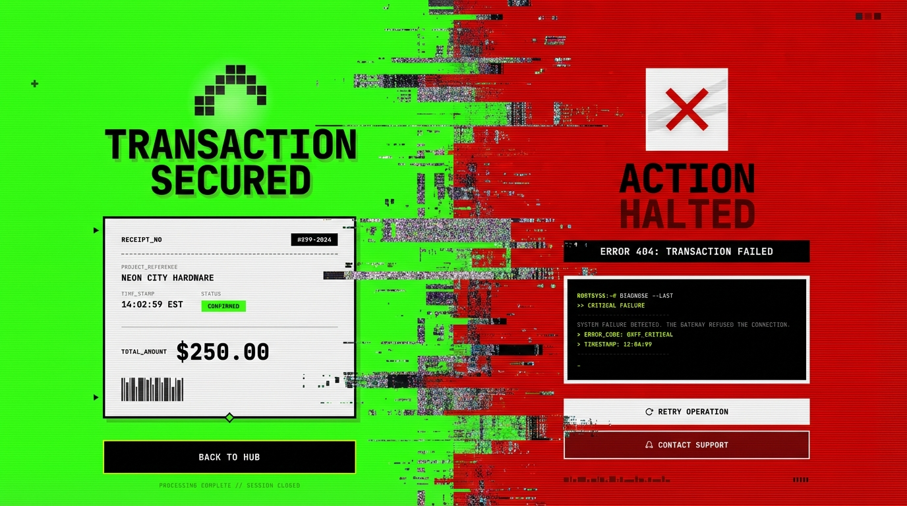
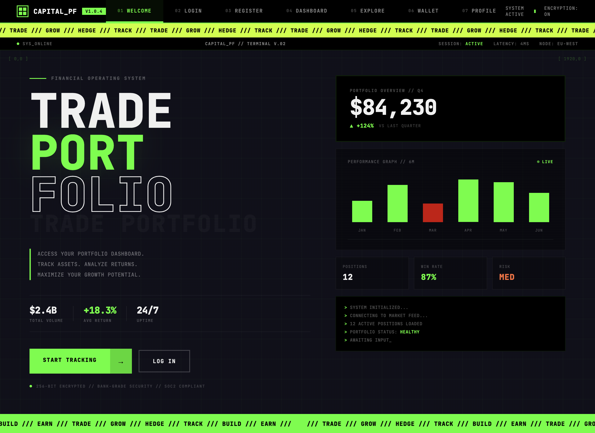

# CAPITAL_PF // PORTFOLIO TERMINAL

> A brutalist, terminal-inspired financial portfolio UI built with pure HTML, CSS, and JavaScript.


---

## Overview

CAPITAL_PF is a frontend UI kit / design prototype for a financial portfolio management platform. It features a **dark terminal aesthetic** with monospace typography, neon green accents, scanline effects, and a brutalist design language. The project is a single-page application with 16 distinct screens, all navigable through a tabbed interface.

**No frameworks. No build tools. No dependencies.** Just raw HTML, CSS, and vanilla JavaScript.

---

## Screenshots



| | | |
| :--: | :--: | :--: |
|  |  |  |
|  |  |  |
|  |  |  |
|  |  |  |

Open `index.html` in your browser to see the full UI in action.

---

## Pages / Screens

| #  | Page            | Description                                              |
|----|-----------------|----------------------------------------------------------|
| 01 | **Welcome**     | Landing page with portfolio overview, performance chart, and terminal log |
| 02 | **Login**       | Secure authentication screen with terminal decoration    |
| 03 | **Register**    | Account creation with password strength indicator        |
| 04 | **Dashboard**   | Main portfolio dashboard with assets, stats, and charts  |
| 05 | **Explore**     | Browse and discover investment opportunities             |
| 06 | **Wallet**      | Wallet overview with balances and transaction history    |
| 07 | **Profile**     | User profile and account settings                        |
| 08 | **Project**     | Individual project/asset detail view                     |
| 09 | **Deposit**     | Fund deposit flow with source selection and fee summary  |
| 10 | **Withdraw**    | Withdrawal flow with destination and fee calculation     |
| 11 | **Error**       | Error state page (red theme)                             |
| 12 | **Success**     | Success confirmation page (green theme)                  |
| 13 | **Search**      | Search interface for assets and projects                 |
| 14 | **Filters**     | Advanced filtering and sorting controls                  |
| 15 | **Feed**        | Notifications and activity feed                          |
| 16 | **News**        | Market news and updates                                  |

---

## Tech Stack

- **HTML5** - Semantic markup, single-file SPA structure
- **CSS3** - Custom properties, grid/flexbox layouts, keyframe animations, scanline effects
- **Vanilla JavaScript** - Page navigation, form interactions, dynamic calculations
- **Fonts** - [JetBrains Mono](https://fonts.google.com/specimen/JetBrains+Mono) & [Space Mono](https://fonts.google.com/specimen/Space+Mono) (via Google Fonts)

---

## Design System

### Color Palette

| Token           | Hex       | Usage                        |
|-----------------|-----------|------------------------------|
| `--navy-deep`   | `#0f0f1a` | Background                   |
| `--navy`        | `#1a1a2e` | Secondary background         |
| `--navy-light`  | `#252547` | Card / elevated surfaces     |
| `--green`       | `#39ff14` | Primary accent, success      |
| `--lime`        | `#c6ff00` | Ticker, secondary accent     |
| `--orange`      | `#ff6b35` | Warning, CTA highlights      |
| `--purple`      | `#7c4dff` | Tertiary accent              |
| `--white`       | `#f0f0f0` | Text                         |
| `--black`       | `#000000` | Navigation bar, contrast     |

### Typography

All text is rendered in **uppercase monospace** (`JetBrains Mono` / `Space Mono`) with increased letter-spacing for the terminal aesthetic.

### Effects

- **Scanlines** - CRT-style overlay on page backgrounds
- **Glitch text** - CSS-only glitch animation on titles
- **Blinking cursor** - Terminal cursor effect
- **Animated ticker** - Continuous scrolling marquee strips
- **Bar chart animations** - Animated performance bars on the welcome page
- **Grid backgrounds** - Dot-grid / line-grid decorative patterns

---

## Getting Started

### Prerequisites

A modern web browser (Chrome, Firefox, Safari, Edge).

### Installation

```bash
git clone https://github.com/radioheavy/capital_pf_ui.git
cd capital_pf_ui
```

### Usage

Open `index.html` directly in your browser:

```bash
# macOS
open index.html

# Linux
xdg-open index.html

# Windows
start index.html
```

Or use any local dev server:

```bash
# Python
python3 -m http.server 8000

# Node.js (npx)
npx serve .

# VS Code
# Install "Live Server" extension and click "Go Live"
```

Then navigate to `http://localhost:8000`.

---

## Project Structure

```
capital_pf_ui/
├── index.html      # All 16 pages in a single HTML file
├── styles.css      # Complete styling with design system and animations
├── script.js       # Page navigation, form logic, and interactions
├── .gitignore      # Git ignore rules
└── README.md       # This file
```

---

## Features

- **Zero dependencies** - No npm, no build step, no framework overhead
- **Single-file SPA** - All pages contained in one HTML file with tab-based navigation
- **Fully responsive navigation** - Scrollable tab bar for all screen sizes
- **Dynamic ticker theming** - Ticker bar changes color based on active page context
- **Interactive deposit/withdraw** - Real-time fee calculation with selectable funding sources
- **Password strength meter** - Visual indicator with animated strength bars
- **CRT terminal effects** - Scanlines, grid overlays, blinking cursors, glitch text
- **Brutalist design language** - Bold typography, sharp corners, high-contrast color palette

---

## Browser Support

| Browser | Version |
|---------|---------|
| Chrome  | 90+     |
| Firefox | 88+     |
| Safari  | 14+     |
| Edge    | 90+     |

---

## License

This project is licensed under the MIT License.

---

## Author

**radioheavy**

---

<p align="center">
  <code>/// TRADE /// GROW /// HEDGE /// TRACK ///</code>
</p>
